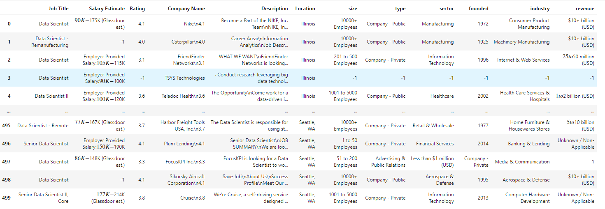

# Data Scientist Salary Prediction

-

## Resources Used

Packages : Pandas

## Data Collection

The data we got from glassdoor.com up to 1000 sample, and this what we got:

- Job Title
- Salary Estimate
- Rating
- Company Name
- Location
- Size
- Type
- Sector
- Founded
- Industry
- Revenue

## Data Cleaning

In this part we cleaning the data we change and create column, this following change :

- Remove rating in Company column
- Make neew colum to describe salary estimate
  - Minimal Salary
  - Maximun salary
  - Average salary
- Create age company from founded
- Colum for skill get form description
  - python
  - matlab
  - spark
  - sql
- Simplified job title

## Data Exploration
